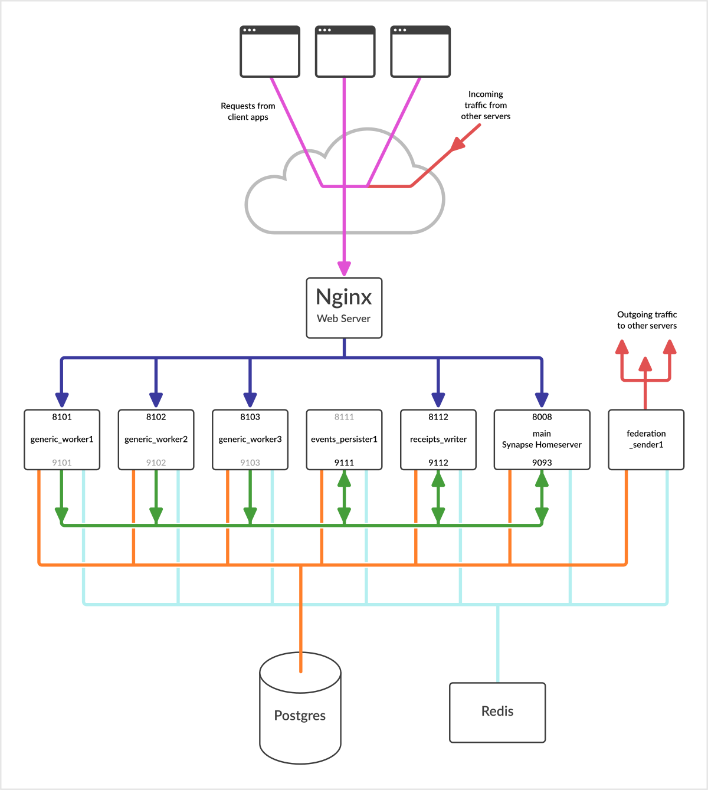

This repository contains an example configuration for a deployment of the
[Matrix Synapse][synapse-repo] server with multiple worker processes.

I put this together with reference to the [canonical documentation for Synapse
workers][workers-docs], the [Synapse configuration guide][config-guide] and
help from the [Synapse Admins room on matrix.org][synapse-room].

Note you should not attempt to set up a Synapse server and workers without
reading the above documentation.  However if you need some additional context
or examples to understand what the documentation is telling you, the example
files here may be useful.

The intended configuration is summarised in the image below:



The main homeserver process is supplemented with six worker processes:

- 3 generic workers to handle a variety of incoming client requests
- 1 events persister worker to handle writing the events stream
- 1 receipts writer worker to handle writing the `receipts` stream and the
  `typing` stream
- 1 federation sender to handle outgoing traffic to other servers

Incoming requests from clients (red) and other Matrix servers (purple) are
received over HTTPS by Nginx.

The Nginx server proxies the requests (blue) over HTTP to different worker
processes running on the local host (although potentially you could split the
workload over multiple hosts).

Each worker might be listening on a port in the 8xxx range for requests
received via Nginx (blue).  In this example, the `events_persister1` worker has
a port allocation of 8111 that is greyed out in the diagram because this worker
is not set up to handle any requests from Nginx and isn't actually listening on
that port.

Additionally, each worker might listen on another port in the 9xxx range
(green) for "replication" requests from other workers.  The `generic_worker`s
in the diagram have these ports greyed out because they are not set up to
listen for requests from other workers.

All workers can communicate directly with Postgres (orange) and Redis (cyan).
Certain database writes are handled by so-called "stream writers".

The federation sender handles outgoing traffic by making requests over HTTPS to
other matrix servers.

Note these port ranges are completely arbitrary - you can choose port numbers
that work for you.  It's important to remember that the worker replication ports
(the 9xxx ones in my example) should never be exposed via Nginx and should only
accept connections from other local workers.

In this repo you'll find:

- a fairly complete [homeserver.yaml](etc/matrix-synapse/homeserver.yaml)
- a set of [config files for workers](etc/matrix-synapse/workers)
- a set of [systemd unit files](etc/systemd/system) for managing the main and
  worker processes
- an [Nginx config](etc/nginx/nginx.conf) for mapping requests to worker ports
  based on the request URL path

## `homeserver.yaml`

The key section is:

```
instance_map:
  main:
    host: localhost
    port: 9093
  events_persister1:
    host: localhost
    port: 9111
  receipts_writer:
    host: localhost
    port: 9112
federation_sender_instances:
    - federation_sender1
stream_writers:
  events:
    - events_persister1
  receipts: receipts_writer
  typing: receipts_writer
```

A worker would refer to the [`stream_writers`][stream-writers-docs]
configuration (in [`homeserver.yaml`][homeserver-yaml]) to determine which
worker is responsible for handling a particular stream.  Then it would refer to
the [`instance_map`][instance-map-docs] configuration to determine which port
number the named worker is listening on.  A worker knows which port to listen
on based on the individual worker config file - so the port number listed in
the worker config must match the port number in the `instance_map`.  The first
`instance_map` entry "main" is the synapse homeserver process.

The `generic_worker`s are not listed in the instance map, since they are not
listening on a replication port.

Similarly, the `federation_sender` does not use a replication port, but it must
be listed under [`federation_sender_instances`][fed-send-inst-docs], which
allows you to list multiple sender instances to share the outgoing traffic load.

## Systemd unit files

Reference docs: [Setting up Synapse with Workers and Systemd][systemd-workers-docs].

It has been pointed out that the setup in this repo, with one unit file per
worker type, is overly complex.  In practice the only difference is the worker
name and that can be factored out to the part of the service name after the
`@`.

The full set of processes can be restarted with:

```
systemctl restart matrix-synapse.target
```

## Nginx Config

The Nginx config here routes each incoming request to a specific "upstream"
based on the URL path of each request.  The "upstreams" named in the sample
Nginx config are:

- `synapse` goes directly to the main home server process. This is the default
  upstream, so any URL path not mentioned will go here.  Some paths are routed
  to this upstream specifically, to document the fact that they cannot be handled
  by the `generic_worker`s.

- `generic-worker` load balances requests across the three `generic_worker`
  processes, with requests from the same source IP having affinity for a
  specific worker.

- `generic-worker-user` load balances requests across the three
  `generic_worker` processes, with requests from the same user session having
  affinity for a specific worker.

This config gets the URL paths from [the worker docs][worker-url-docs], which
also contain suggestions on affinity for improved caching of some paths.

[synapse-repo]: https://github.com/matrix-org/synapse/
[workers-docs]: https://matrix-org.github.io/synapse/latest/workers.html
[config-guide]: https://matrix-org.github.io/synapse/latest/usage/configuration/config_documentation.html
[synapse-room]: https://app.element.io/#/room/#synapse:matrix.org
[stream-writers-docs]: https://matrix-org.github.io/synapse/latest/usage/configuration/config_documentation.html?highlight=stream_writers#stream_writers
[homeserver-yaml]: etc/matrix-synapse/homeserver.yaml
[instance-map-docs]: https://matrix-org.github.io/synapse/latest/usage/configuration/config_documentation.html?highlight=instance_map#instance_map
[fed-send-inst-docs]: https://matrix-org.github.io/synapse/latest/usage/configuration/config_documentation.html?highlight=federation_sender_instances#federation_sender_instances
[systemd-workers-docs]: https://github.com/matrix-org/synapse/tree/develop/docs/systemd-with-workers
[worker-url-docs]: https://matrix-org.github.io/synapse/latest/workers.html#available-worker-applications
